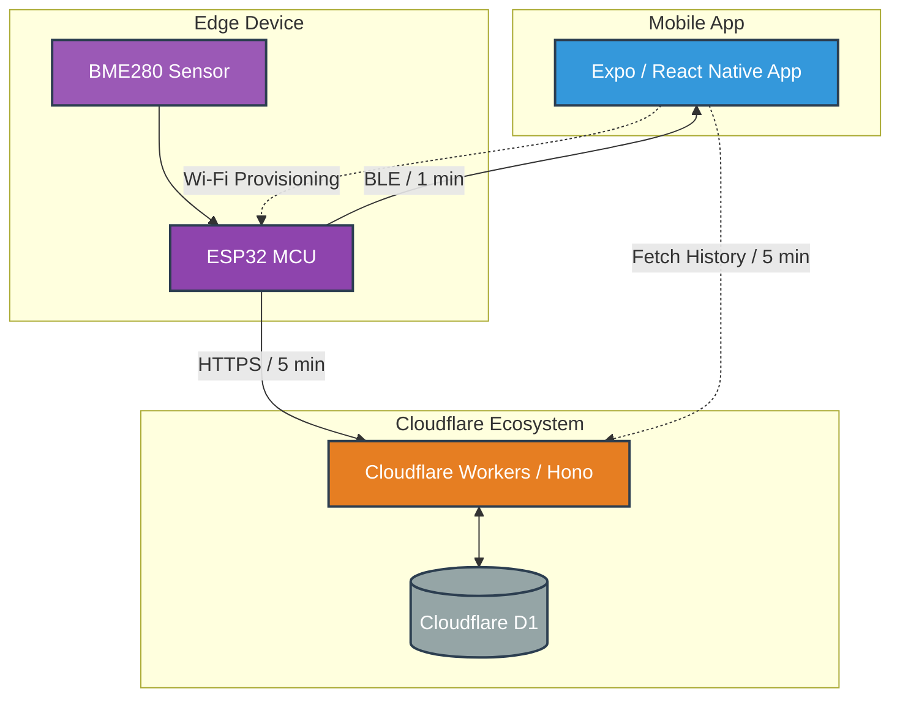
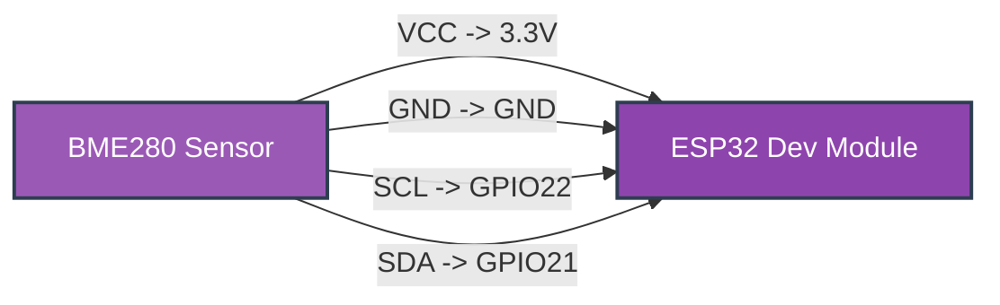

# 🌡️ Ambient Monitor

An IoT project that visualizes environmental data (temperature, humidity, pressure) collected from an ESP32 + BME280 sensor
on a mobile application (Expo / React Native).

- ESP32 sends data to Cloudflare Workers (Hono) every **5 minutes**
- When connected via Bluetooth, ESP32 sends data to the mobile app every **1 minute**
- When Bluetooth is unavailable, the app fetches data from the backend API

### 📱 App Screenshots

<table>
  <tr>
    <td align="center" width="33%">
      
      <br>
      <sub>Home Screen: Shows current temperature, humidity, and pressure (Bluetooth)</sub>
    </td>
    <td align="center" width="33%">
      
      <br>
      <sub>Graph Screen: Visualizes data for the past 24 hours, 7 days, and 30 days</sub>
    </td>
    <td align="center" width="33%">
      
      <br>
      <sub>Settings Screen: Theme, language, Bluetooth & Wi-Fi settings</sub>
    </td>
  </tr>
</table>

---

## 💡 Motivation

I wanted to monitor indoor temperature and humidity in real-time on my smartphone,
so I created this project as an app I personally wanted to use.

Since I use dehumidifiers and humidifiers depending on the season,
I also wanted to quantitatively see how these devices affect the indoor environment.

The system is designed to provide both real-time and historical data visualization,
while minimizing power consumption and network traffic.
It is also structured to allow for multiple sensors to be added in the future.

---

### ⚠️ Note

Currently, the mobile app is designed for a single device and for private use,
and user authentication has not been implemented.

The backend and data model are designed to support multiple devices,
and in the future, authentication can be added to safely manage multiple devices.

For now, we prioritize operational stability and plan to gradually expand from a minimal configuration.

---

## 📂 Project Structure

```
ambient-monitor/
├─ firmware/       # Sketch for ESP32
└─ packages/
    ├─ backend/    # Hono + Cloudflare Workers
    └─  mobile/     # Expo (React Native)
```

---

## 🔗 Overall Architecture



---

## 📂 Directory Roles

### ☁️ backend/

- Cloudflare Workers app using Hono
- Receives data from ESP32 every **5 minutes** and stores it in Cloudflare D1
- Provides API endpoints returning aggregated data for the mobile app:
  - Last 24 hours (average per hour)
  - Last 7 days (average per 6 hours)
  - Last 30 days (average per 24 hours)

---

### 📱 mobile/

- Mobile app built with Expo (React Native)
- When connected via Bluetooth:
  - Receives data directly from ESP32 and displays it in real-time (**every 1 minute**)
- When Bluetooth is unavailable:
  - Fetches data from backend API (**every 5 minutes**)
- Visualizes historical data (last 24h / 7d / 30d) in charts
- Provides Wi-Fi setup for ESP32

---

### 🤖 firmware/

- ESP32 firmware
- Reads temperature, humidity, and pressure from BME280 sensor
- Sends data through two channels:
  - Bluetooth (for mobile app)
  - HTTP API (for Cloudflare Workers)
- Sensitive information (Wi-Fi credentials, etc.) is stored in `secrets.h` and not included in the repository

---

## ⚙️ Technical Highlights

### 🔥 Hono RPC

The backend uses Hono RPC to ensure type safety across:

- Backend API implementation
- Backend tests
- API calls from the mobile app (Expo)

This allows API response types and arguments to be checked at compile time,
reducing runtime errors.

---

## 🛠️ Development

This project combines ESP32 firmware, Cloudflare Workers backend, and a mobile app.
Development is focused on these three components:

### ☁️ Backend (Cloudflare Workers)

- API implemented using Hono
- Stores data in D1
- Provides type-safe API via Hono RPC
- Local development and testing are performed in the Workers environment
- API types are shared with the mobile app

### 📱 Mobile App

- Built with Expo (React Native)
- Switches data source depending on Bluetooth connection:
  - With Bluetooth: receives data directly from ESP32 (every 1 minute)
  - Without Bluetooth: fetches data from backend API (every 5 minutes)
- Allows configuring ESP32 Wi-Fi directly from the app
- Shared types enable compile-time detection of backend API changes

<!-- Home -->
<table>
  <tr>
    <td align="center" width="50%">
      
      <br>
      <sub>Home Screen: Shows current temperature, humidity, and pressure (Bluetooth)</sub>
    </td>
    <td align="center" width="50%">
      
      <br>
      <sub>Home Screen: Shows current temperature, humidity, and pressure (API)</sub>
    </td>
  </tr>
</table>

<!-- Graph -->
<table>
  <tr>
    <td align="center" width="50%">
      
      <br>
      <sub>Graph Screen: Visualizes data for the past 24 hours, 7 days, and 30 days</sub>
    </td>
    <td align="center" width="50%">
      <!--  -->
    </td>
  </tr>
</table>

<!-- Settings -->
<table>
  <tr>
    <td align="center" width="50%">
      
      <br>
      <sub>Settings Screen: Theme, language, Bluetooth & Wi-Fi settings</sub>
    </td>
    <td align="center" width="50%">
      <!--  -->
    </td>
  </tr>
</table>

<!-- Bluetooth -->
<table>
  <tr>
    <td align="center" width="50%">
      
      <br>
      <sub>Bluetooth Screen: Connected to ESP32</sub>
    </td>
    <td align="center" width="50%">
      
      <br>
      <sub>Bluetooth Screen: ESP32 connection setup</sub>
    </td>
  </tr>
</table>

<!-- Wi-Fi -->
<table>
  <tr>
    <td align="center" width="50%">
      
      <br>
      <sub>Wi-Fi Screen: Password hidden</sub>
    </td>
    <td align="center" width="50%">
      <!--  -->
    </td>
  </tr>
</table>

### 🤖 ESP32 Firmware

- Device: ESP32 Dev Module
- Sensor: BME280 (I2C connection)
- Sensitive information (Wi-Fi credentials, etc.) is defined in `secrets.h` and not included in the repository
- Arduino IDE is used for building and flashing the firmware



<p align="center">
  
  <br>
  <sub>ESP32 - BME280 Wiring Diagram</sub>
</p>
