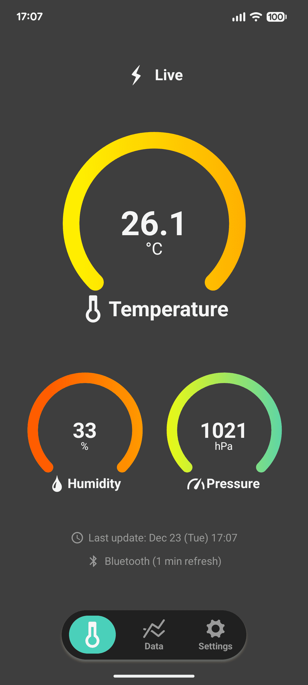
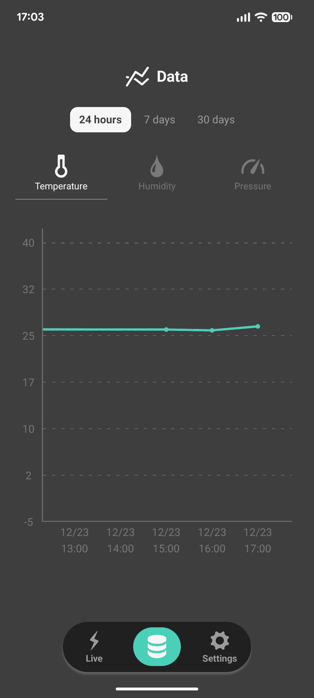
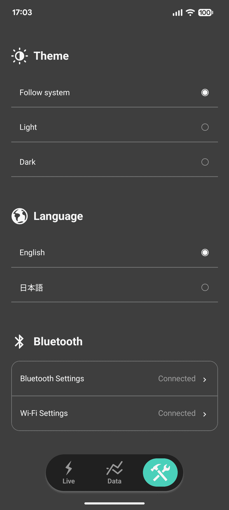
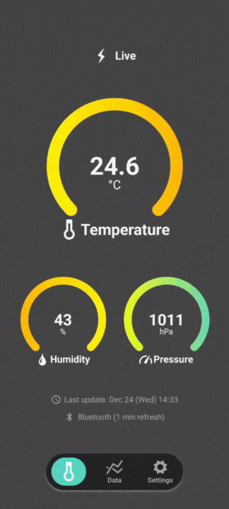
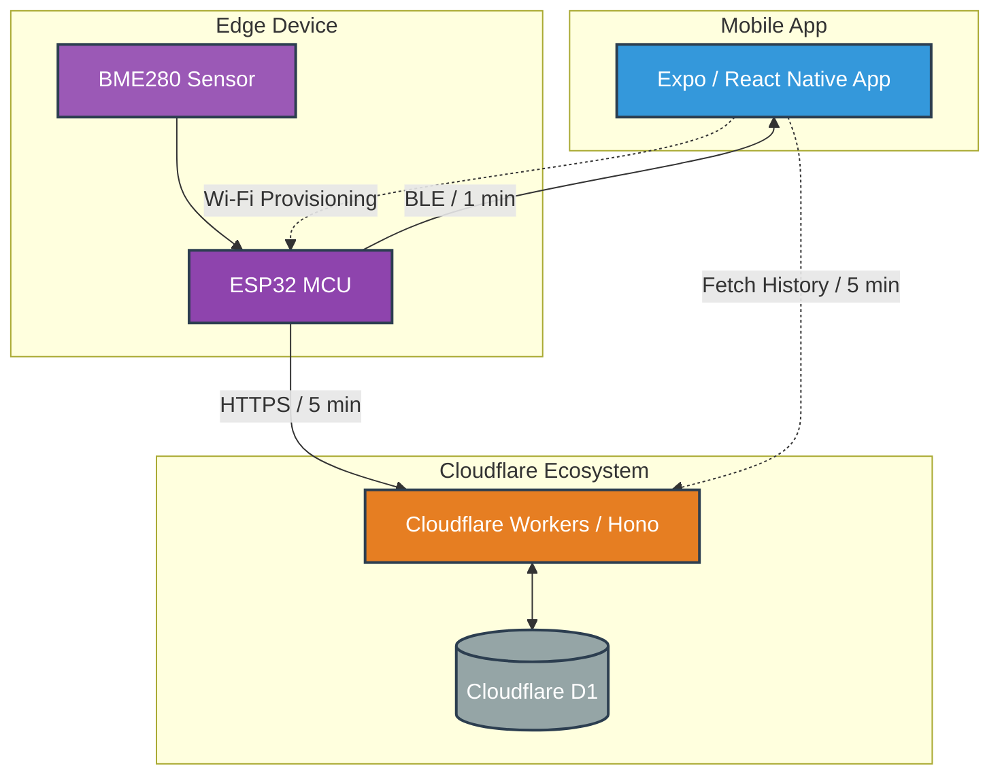
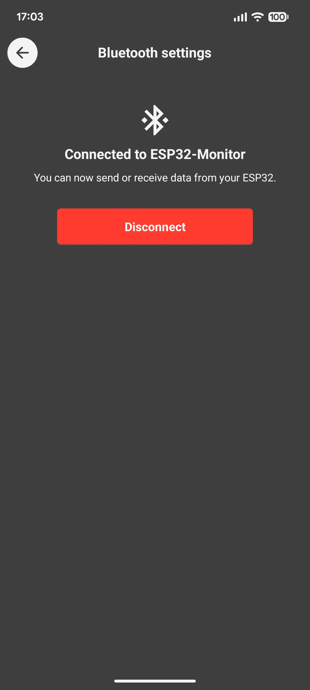
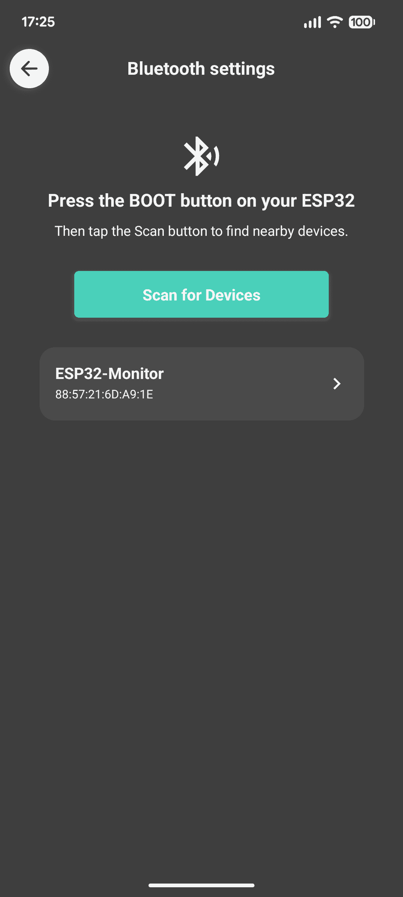
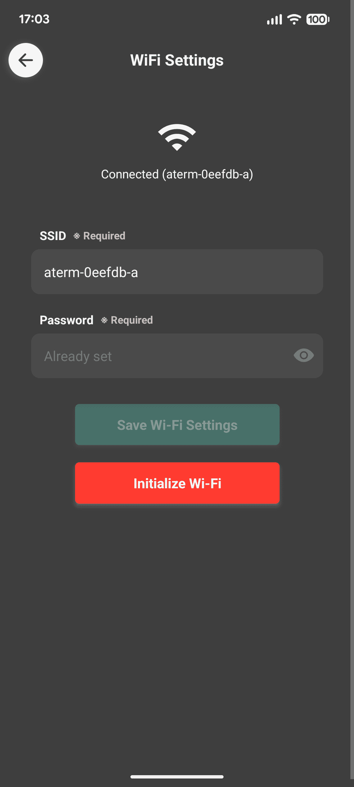
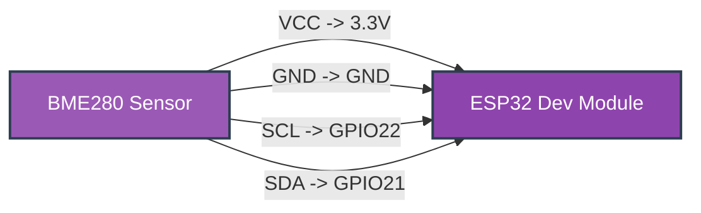
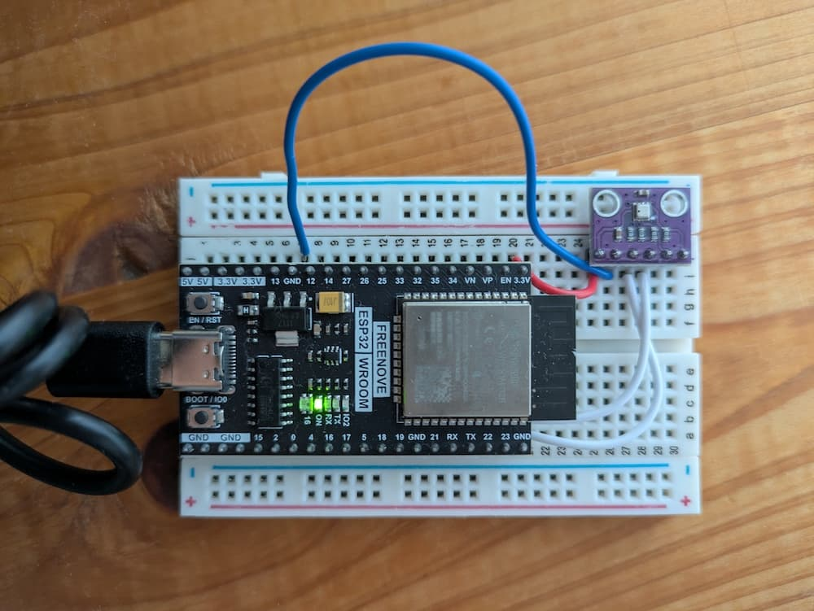

# 🌡️ Ambient Monitor

ESP32 + BME280 で取得した環境データ（気温・湿度・気圧）を、
モバイルアプリ（Expo / React Native）で可視化する IoT プロジェクトです。

- ESP32 が取得したデータを **5 分間隔** で Cloudflare Workers（Hono）に送信
- Bluetooth 接続時は、ESP32 から取得したデータを **1 分間隔** でモバイルアプリへ送信
- Bluetooth 未接続時は、バックエンド API 経由でデータを取得・表示

### 📱 アプリ画面

<table>
  <tr>
    <td align="center" width="33%">
      
      <br>
      <sub>ホーム画面: 現在の温度・湿度・気圧を表示（Bluetooth接続時）</sub>
    </td>
    <td align="center" width="33%">
      
      <br>
      <sub>グラフ表示: 過去24時間、7日間、30日間のデータを可視化</sub>
    </td>
    <td align="center" width="33%">
      
      <br>
      <sub>設定画面: テーマ、言語、Bluetooth・Wi-Fi設定一覧</sub>
    </td>
  </tr>
</table>

---

## 🎥 アプリデモ

<p align="center">
  
</p>

---

## 💡 モチベーション

自宅内の温度・湿度をスマートフォンでリアルタイムに把握したいと考え、
自分自身が「欲しい」と思えるアプリとしてこのアプリを作成しました。

季節によって除湿機や加湿器を使用していて、
それらが室内環境にどの程度影響しているのかを定量的に確認したいという背景があります。

リアルタイム確認と過去データの可視化を両立しつつ、
省電力・低通信コストで、将来的に自宅内へ複数センサーを設置することも視野に入れた構成を目指しています。

---

### ⚠️ 補足

現時点ではモバイルアプリ上で単一デバイス・プライベートでの利用を前提としていて、ユーザー認証は導入していません。

バックエンドやデータモデルは複数デバイス対応を想定した設計になっており、
将来的には認証機能を追加することで安全に複数デバイスを管理可能です。

まずは実運用での安定性を優先し、最小構成から段階的に拡張する方針としています。

---

## 📂 プロジェクト構成

```
ambient-monitor/
├─ firmware/       # Sketch for ESP32
└─ packages/
    ├─ backend/    # Hono + Cloudflare Workers
    └─  mobile/     # Expo (React Native)
```

---

## 🔗 全体構成図



---

## 📂 各ディレクトリの役割

### ☁️ backend/

- Hono を使用した Cloudflare Workers アプリ
- ESP32 から送信された環境データを **5 分間隔** で受信し、Cloudflare D1 に保存
- モバイルアプリ向けに、以下の集計済みデータを返す API を提供
  - 過去 24 時間（1 時間ごとの平均値）
  - 過去 7 日間（6 時間ごとの平均値）
  - 過去 30 日間（24 時間ごとの平均値）

---

### 📱 mobile/

- Expo（React Native）で構築したモバイルアプリ
- Bluetooth 接続時
  - ESP32 から直接データを受信し、**1 分間隔** でリアルタイム表示
- Bluetooth 未接続時
  - バックエンド API からデータを取得し、**5 分間隔** で表示
- 過去 24 時間 / 7 日間 / 30 日間のデータをグラフで可視化
- ESP32 への Wi-Fi 接続設定機能を提供

---

### 🤖 firmware/

- ESP32 用ファームウェア
- BME280 センサーから温度・湿度・気圧を取得
- 以下の 2 つの経路でデータを送信
  - Bluetooth（モバイルアプリ向け）
  - HTTP API（Cloudflare Workers 向け）
- 機密情報（Wi-Fi 設定など）は `secrets.h` に定義し、リポジトリには含めない設計

---

## ⚙️ 技術的ハイライト

### 🔥 Hono RPC

バックエンドには Hono RPC を採用し、
API 定義から以下の箇所で型安全性を担保しています。

- バックエンドの API 実装
- バックエンドのテストコード
- モバイルアプリ（Expo）からの API 呼び出し

これにより、API のレスポンス型や引数の変更が
コンパイル時に検出される構成になっています。

---

## 🛠️ 開発環境・構成

本プロジェクトは ESP32・Cloudflare Workers・モバイルアプリを
組み合わせた構成のため、以下の 3 つを中心に開発しています。

### ☁️ Backend (Cloudflare Workers)

- Hono を使用した API 実装
- D1 を利用したデータ保存
- Hono RPC により型安全な API を提供
- Workers 環境でのローカル開発およびテストを実施
- API の型定義はモバイルアプリと共有

### 📱 Mobile App

- Expo (React Native)
- Bluetooth 接続時 / 非接続時でデータ取得経路を切り替え
  - Bluetooth 接続時: ESP32 から直接受信（1 分間隔）
  - 非接続時: バックエンド API から取得（5 分間隔）
- ESP32 の Wi-Fi 設定をアプリ上で行える
- 型定義を共有しており、バックエンド API 変更時もコンパイル時に検出可能

<!-- Home -->
<table>
  <tr>
    <td align="center" width="50%">
      
      <br>
      <sub>ホーム画面: 現在の温度・湿度・気圧を表示（Bluetooth接続時）</sub>
    </td>
    <td align="center" width="50%">
      
      <br>
      <sub>ホーム画面: 現在の温度・湿度・気圧を表示（API接続時）</sub>
    </td>
  </tr>
</table>

<!-- Graph -->
<table>
  <tr>
    <td align="center" width="50%">
      
      <br>
      <sub>グラフ表示: 過去24時間、7日間、30日間のデータを可視化</sub>
    </td>
    <td align="center" width="50%">
      <!--  -->
    </td>
  </tr>
</table>

<!-- Settings -->
<table>
  <tr>
    <td align="center" width="50%">
      
      <br>
      <sub>設定画面: テーマ、言語、Bluetooth・Wi-Fi設定一覧</sub>
    </td>
    <td align="center" width="50%">
      <!--  -->
    </td>
  </tr>
</table>

<!-- Bluetooth -->
<table>
  <tr>
    <td align="center" width="50%">
      
      <br>
      <sub>Bluetooth接続画面: ESP32との接続中</sub>
    </td>
    <td align="center" width="50%">
      
      <br>
      <sub>Bluetooth接続画面: ESP32との接続設定</sub>
    </td>
  </tr>
</table>

<!-- Wi-Fi -->
<table>
  <tr>
    <td align="center" width="50%">
      
      <br>
      <sub>Wi-Fi接続画面: パスワードは非表示</sub>
    </td>
    <td align="center" width="50%">
      <!--  -->
    </td>
  </tr>
</table>

### 🤖 ESP32 Firmware

- デバイス: ESP32 Dev Module
- センサー: BME280（I2C 接続）
- ファームウェアの機密情報（Wi-Fi 設定など）は `secrets.h` に定義し、リポジトリには含めない設計
- 開発時は Arduino IDE を使用してビルド・書き込みを行っています



<p align="center">
  
  <br>
  <sub>ESP32 - BME280 配線図</sub>
</p>
